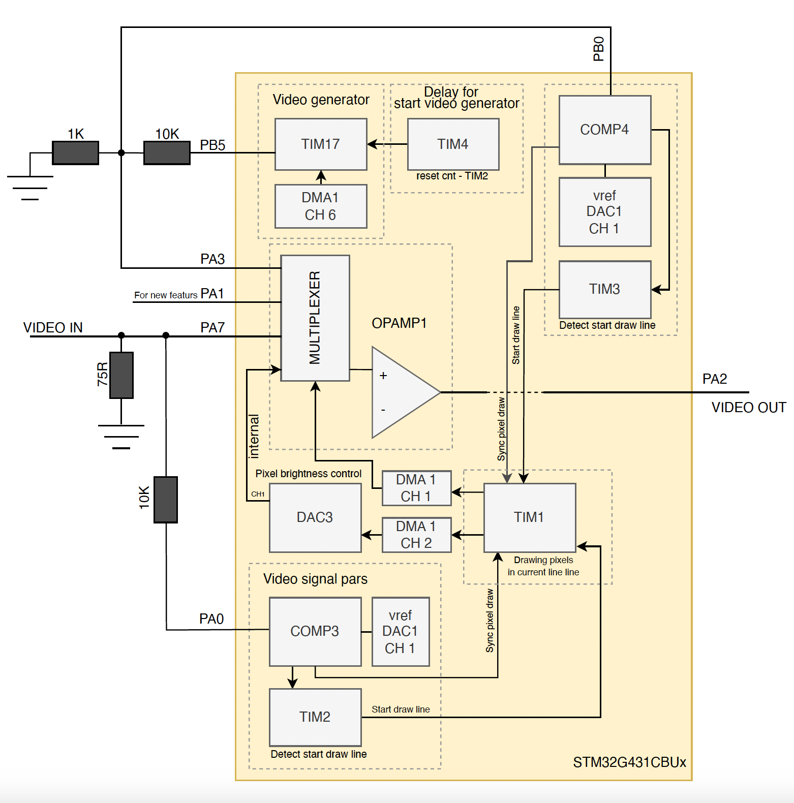
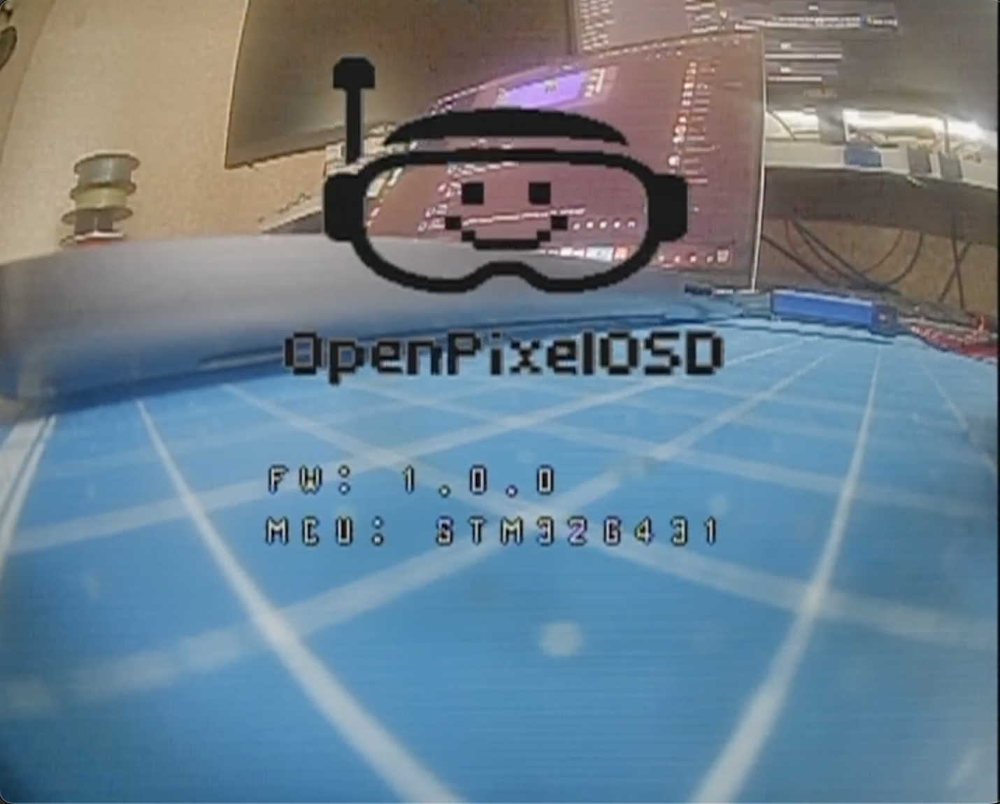

# OpenPixelOSD

OpenPixelOSD is an open-source project for generating and overlaying pixel graphics onto a video signal (OSD), based on the **STM32G431CBUx** microcontroller.
The project aims to create a software monochrome On-Screen Display (OSD) for VPV to phase out the obsolete *MAX7456* chip which has been discontinued


## Repository Structure
```pgsql
.github/workflows/     - CI build for STM32G431/G474
doc/                   - diagrams and images
cmake/                 - toolchain & stm32 library CMake scripts
python/                - helper scripts (font/logo conversion, font upload)
USB_Device/, Drivers/, Middlewares/ - STM32Cube generated code
src/                   - firmware source (C code)
  stm32g4xx/           - device startup, HAL configuration
  msp/                 - MSP protocol parser/handler
  fonts/, logo/        - embedded font/logo data and updater
CMakeLists.txt         - top‑level build file
```

#### Key Components

`src/main.c` – program entry. Initializes hardware modules, then continually processes **MSP** messages and blinks an **LED**.

`src/video_overlay.c` – core video overlay logic. Sets up **DACs**, timers and comparators to mix the generated OSD pixels with the incoming video signal.

`src/msp/` – implements the **MultiWii Serial Protocol** (MSP) for interacting with flight controllers.

`src/canvas_char.*` – double‑buffered character canvas used for text rendering onto the video overlay.

`python/` – scripts to convert fonts or bitmaps into C arrays for embedding. For example, `convert_logo.py` reads an image, maps colors to 2‑bpp pixels, and outputs a header file. `font_updater.py` sends font data over serial using **MSP** commands.

#### Build and Continuous Integration

The GitHub workflow in `.github/workflows/build.yml` checks out the repo, installs the **Arm GNU toolchain**, builds the firmware for both MCU variants, and uploads the `.hex` and `.bin` artifacts.

#### What to Explore Next

* **Hardware setup** – Review `README.md` and the diagrams in `doc/` to understand signal routing and timing requirements.

* **Build system** – Read `CMakeLists.txt` and `cmake/` scripts to learn how the project is compiled and linked for different microcontrollers.

* **Video overlay internals** – Study `video_overlay.c` and `video_gen.c` to see how DMA and timers generate the analog video waveform.

* **MSP protocol** – Examine `src/msp/` to understand communication with flight controllers.

* **Python utilities** – The scripts in `python/` show how fonts and logos are converted to C data for flashing onto the device.

The project is licensed under GPL‑2.0, as noted in the LICENSE file. With these parts in mind, a newcomer can navigate the firmware, experiment with modifying fonts/logo data, and extend the OSD functionality.

*Important configuration options live in the main `CMakeLists.txt`. The `TARGET_MCU` variable switches between `STM32G431` and `STM32G474` builds.*

## How It Works

### Hardware Architecture

- The **STM32G431CBUx microcontroller** handles control and pixel data generation.
- The input video signal is fed into the **OPAMP1 multiplexer input - PA7**, operating in **follower mode**, and to the comparator positive input `vin+` **COMP3 - PA0** for synchronization.
- **DAC1 Channel 1** is used as the negative reference `vref-` for the comparator.
- If no input video signal is present, **TIM17** generates a PWM signal on pin **PB5** to create the video signal.
- To simplify the video signal detection logic and the generation of the internal video signal **TIM17** generates **reference video** signal by producing **PWM** on pin **PB5**, supporting interlaced or progressive scanning.
- Due to the lack of internal synchronization between **TIM17**, **DMA1 Channel 6**, and **TIM1** for precise line start synchronization of the generated video signal, **COMP4** is used, connected via a **1:10** resistive divider to the `vin+` input of **COMP4** and to the **PA3** input of the **OPAMP1** multiplexer.
- Comparators **COMP3** and **COMP4** are used for video signal "parsing" and line start detection.
- The output video signal is formed by mixing (fast switching) signals from the internal **DAC3 Channel 1** and the input video **PA7** via the built-in multiplexer.
- **TIM2** and **TIM3** provide precise synchronization for line and frame start:
  - TIM2 and TIM3 track line start and trigger pixel rendering accordingly.
  - TIM1 handles pixel rendering in the line by transferring two buffers via **DMA1 Channel 1** and **DMA1 Channel 2**.
  - DMA1 Channel 1 transfers the buffer containing precise timing information for switching the multiplexer connected to the OPAMP1 input.
  - DMA1 Channel 2 transfers the buffer containing brightness values for each pixel to **DAC3 Channel 1** for pixel formation in the line.



### Operating Principle

1. **Video Synchronization:** Comparators detect the start of a video line, enabling synchronization of rendering with the input signal.
2. **Timing:** Timers generate precise timing for the start of each pixel display in the line and manage DMA transactions for data transfer.
3. **Rendering:** The processor generates pixel data as a monochrome image with grayscale shades in buffers, which DMA then transfers to the DAC and OPAMP.
4. **Signal Formation:** Using the DAC and internal multiplexer OPAMP, the output video signal with the overlaid **OSD**.

### Reference for PAL/NTSC Standards

For detailed information on PAL and NTSC video standards, please refer to the comprehensive article by Martin Hinner:
https://martin.hinner.info/vga/pal.html

This resource provides authoritative timing diagrams, signal structures, and technical explanations essential for accurate video signal generation and processing.

# Key Features

- No external chips required for video signal detection and generation.
- Utilizes hardware timers and DMA to minimize CPU load.
- CCMRAM is used for fast access to critical data and code.
- Precise synchronization is supported via hardware comparators.
- Software scalability: real-time pixel rendering.
- Using the DAC to control pixel brightness.

## Connection and Setup

TODO:


### YouTube Video

[](https://youtu.be/GXBrZya5-nY)

## License

Open source software — see LICENSE in the repository.

---

# 🇺🇦 OpenPixelOSD 🇺🇦

OpenPixelOSD — це open-source проєкт для генерації та накладання піксельної графіки на відеосигнал (OSD), створений на базі **STM32G431CBUx**. 
Проєкт призначений для створення програмного монохромного On-Screen Display (OSD) для FPV, щоб відмовитися від застарілого чіпа *MAX7456*, який знятий з виробництва.

## Як це працює

### Архітектура апаратної частини

- **Мікроконтролер STM32G431CBUx** відповідає за керування і генерацію піксельних даних.
- Вхідний відеосигнал подається на **вхід мультиплексора OPAMP1 - PA7** який працює в **follower** режимі та на вхід компаратора `vin+` **COMP3 - PA0** для синхронізації.
- В якості `vref-` для компаратора, використовується **DAC1 CH1**.
- Щоб не ускладнювати логіку детекції відео сигналу та формування власного відео сигналу - **TIM17** формує **еталонний відеосигнал** шляхом генерації **PWM** на піні **PB5** з підтримкою **черезрядкової** або **прогресивної** розгортки.
- Так як відсутній звʼязок для внутрішньої синхронізації **TIM17**, **DMA1 CH6** та **TIM1** для точної синхронізації початку рядка генерованого відео сигналу використовується **COMP4** під'єднаний через резистивний дільник 1:10 до входу `vin+` **COMP4** та входу **PA3** мультіплексора OPAMP1.
- Компаратори **COMP3** і **COMP4** використовуються для "парсингу" відеосигналу та детекції початку рядка.
- Відеосигнал на виході формується через змішування (швидке перемикання) вбудованим мультіплексором сигналів від **DAC3 CH1** та вхідного відео з **PA7** піна.
- **TIM2**, **TIM3** використовуються для точної синхронізації початку рядка і кадру.:
    - TIM2 і TIM3 відстежують початок лінії та відповідно запускають рендеринг пікселів.
    - TIM1 займається відтворенням пікселів у лінії шляхом передачі двох буферів до **DMA1 CH1** та **DMA1 CH2**.
    - DMA1 CH1 відповідає за передачу буфера який містить точний час коли саме треба перемкнути мультіплексор який під'єднаний до входу OPAMP1.
    - DMA1 CH2 відповідає за передачу буфера (який містить яскравість кожного пікселя) для DAC3 CH1 для формування пікселів в лінії.


### Принцип роботи

1. **Синхронізація відео:** Компаратори визначають момент початку рядка відео, що дозволяє синхронізувати рендеринг з вхідним сигналом.
2. **Таймінги:** Таймери формують точний час, коли починається відображення кожного пікселя в лінії та керують DMA-транзакціями для передачі даних.
3. **Рендеринг:** Процесор генерує піксельні дані у вигляді чорно-білого зображення з відтінками сірого у буферах, які потім DMA передає на DAC і OPAMP.
4. **Формування сигналу:** Використовуючи DAC і внутрішній мультіплексор OPAMP, формується відеосигнал з накладеним **OSD**.

## Основні особливості
- Відсутність зовнішніх мікросхем для детекції та формування відеосигналу.
- Використання апаратних таймерів і DMA для мінімізації навантаження на CPU.
- CCMRAM використовується для швидкого доступу до критичних даних і коду.
- Підтримка точної синхронізації за допомогою апаратних компараторів.
- Програмна масштабованість: рендеринг пікселів у реальному часі з можливістю накладання графіки.
- Використання DAC для керування яскравістю пікселів.

## Підключення та налаштування
TODO:

## Ліцензія

Відкрите програмне забезпечення — дивись LICENSE у репозиторії.

---
